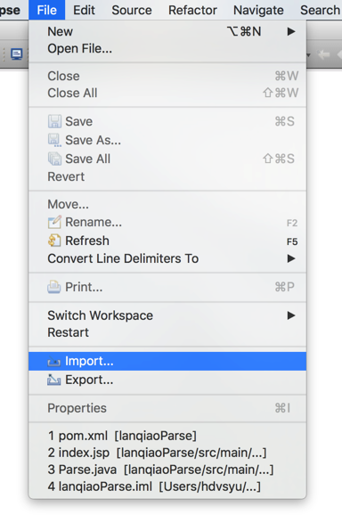
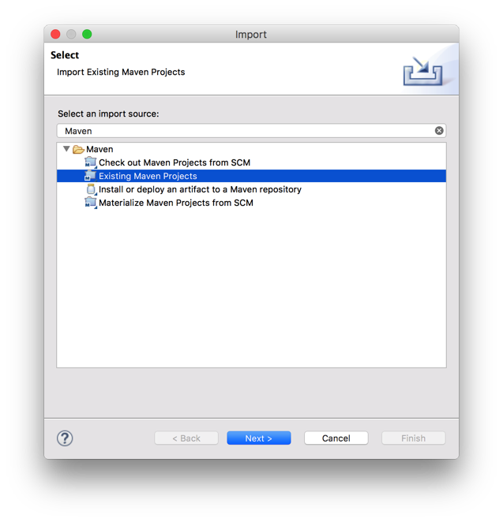
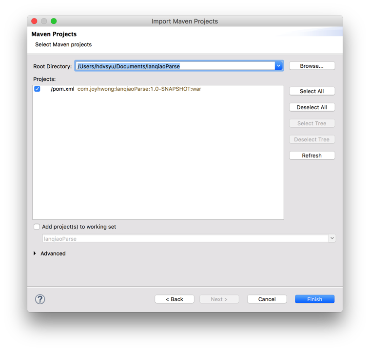
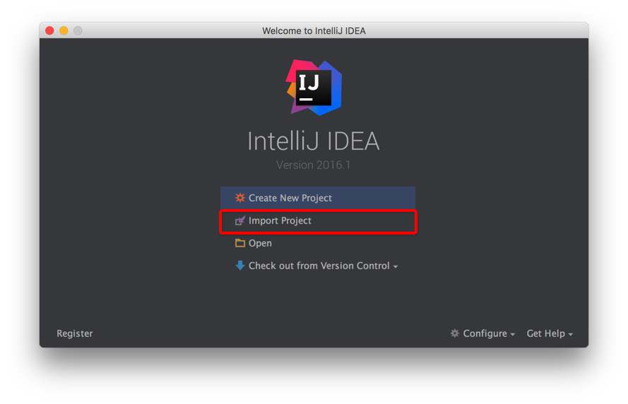
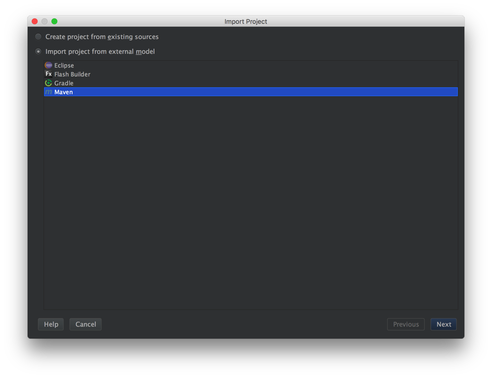
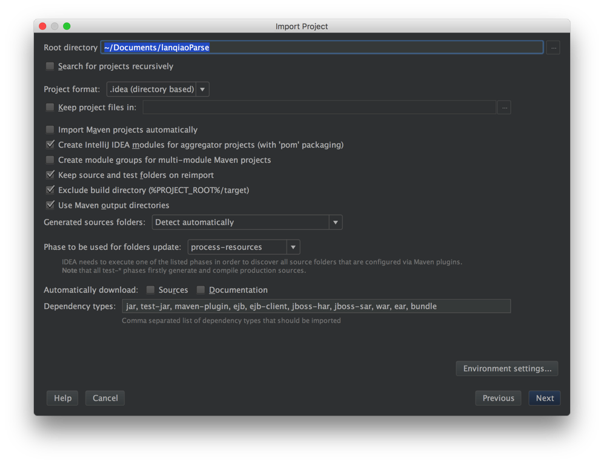
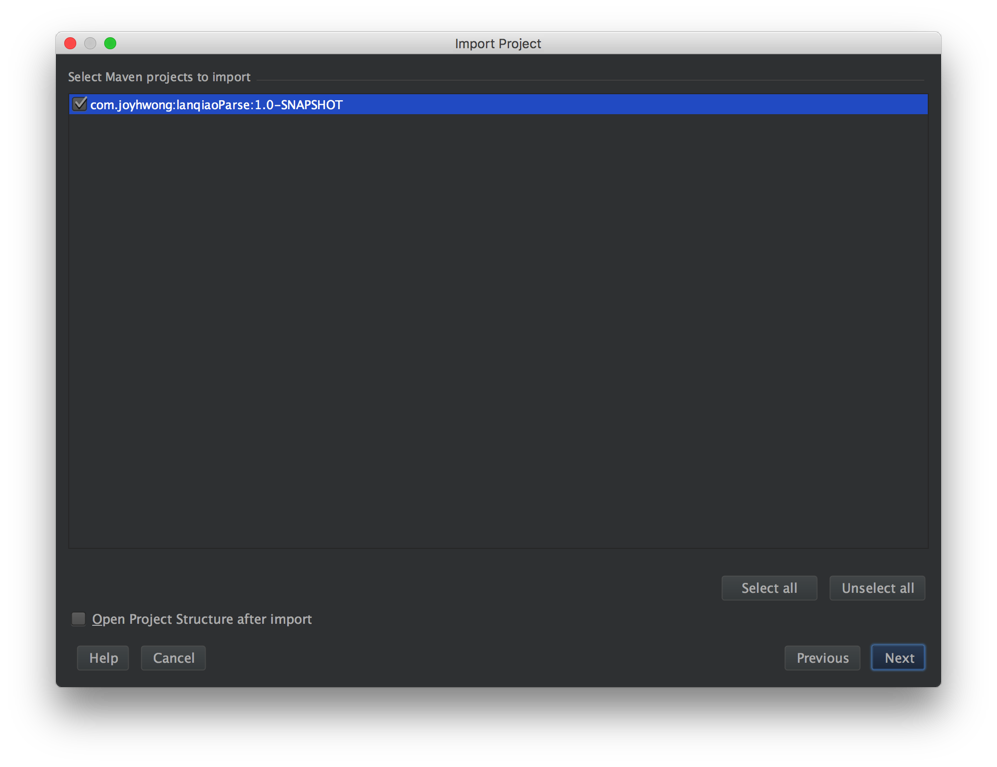
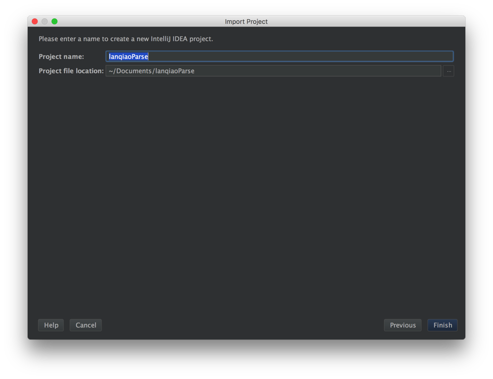

# lanqiaoParse

 

### Get Started

- Eclipse
   
  
  
  ​
- Intellij Idea
  
  
  
  
  
  ​

### Principle

基于[Apache POI](http://poi.apache.org/)的Java命令行程序

### License

[GPL-3.0 License](https://github.com/JoyHwong/lanqiaoParse/blob/master/LICENSE)
